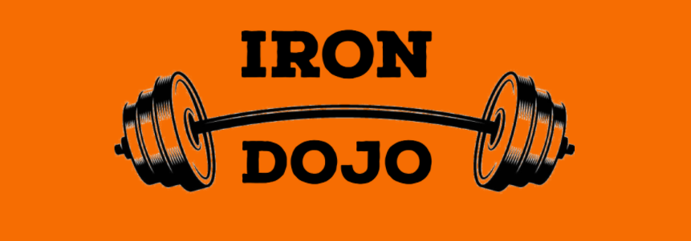
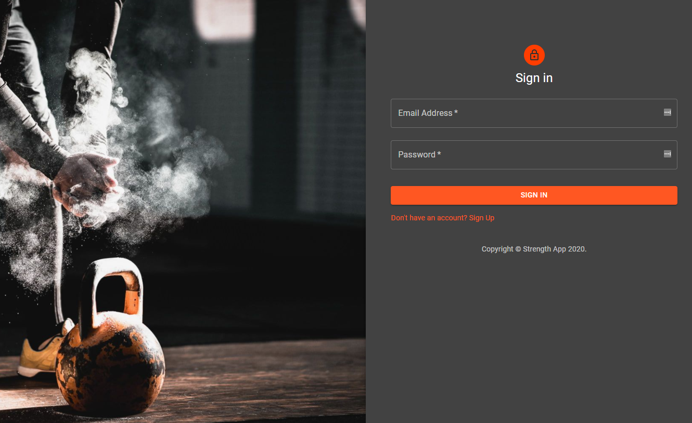

<!-- Iron Dojo - Track Your Strength -->

    
  
          
  
  
  
          
  
          
  

 

  

  <h3 align="center">Iron Dojo</h3>

  

    A web application that allows you to track your strength.
     
    <a href="https://the-iron-dojo.herokuapp.com/"><strong>Explore the Iron Dojo »</strong></a>
     
  

<!-- TABLE OF CONTENTS -->
## Table of Contents

* [About the Project](#about-the-project)
  * [Built With](#built-with)
* [Visit the Site](#visitTheSite)
* [Usage](#usage)
* [Contributing](#contributing)
* [License](#license)
* [Contact](#contact)

<!-- ABOUT THE PROJECT -->
## About The Project

[The Iron Dojo](https://the-iron-dojo.herokuapp.com/)

Exercise is medicine. Physical activity comes in a wide variety of modes including running, team sports, active-virtual-reality games, and of course strength training.  Most web applications are designed for the aerobic exercise enthusiast in mind, but strength training has been show to be incredibly important for health.  

In a [2012 peer reviewed paper by Westcott](https://journals.lww.com/acsm-csmr/Fulltext/2012/07000/Resistance_Training_is_Medicine___Effects_of.13.aspx) the benefits of strength training are thoroughly described.  Some of the health benefits that this style of exercise can confer include (but not limited to):

* increase muscle mass or reduce the loss of muscle mass
* increase resting metabolic rate
* help in managing metabolic disorders (e.g. obesity, Type II Diabetes, etc.)
* improve bone mineral density
* improve mental health

Wether you are looking to improve your health, improve your strength, or simply want to monitor your training, come to the Iron Dojo.  Tracking your progress to understand where your training is headed.

### Built With
* [React](https://reactjs.org/)
* [Material-UI](https://material-ui.com/)
* [JavaScript](https://www.javascript.com/)
* [heroku](https://www.heroku.com/home)
* [wger API](https://wger.de/en/software/api)

## Visit The Site

Visit the live website at [Here](https://the-iron-dojo.herokuapp.com/)

## Usage

The primary purpose of this project is to make, log, and track your strength training. Take a look on how to do that!

1. Sign Up!
    

2. Sign In
    

3. Create your first workout.  Name it, choose the right exercises, and save when you are ready!
    

4. Log the sets, repetitions, weight and select the date the workout was completed on.
    

5. Chart your Progress by selecting an exercise you want to review.
    

## Contributing

Contributions for this web application was made by 
* [Ryan Durk](https://github.com/rpdurk), 
* [Jeff Hogg](https://github.com/bosshogg86), 
* [Qian Hu](https://github.com/huqian301), and 
* [Muhammad Kamran](https://github.com/mkamran67).

<!-- LICENSE -->
## License

MIT License

<!-- CONTACT -->
## Contact

Please contact any of as at:

* Ryan Durk - [https://github.com/rpdurk](https://github.com/rpdurk)
* Jeff Hogg - [https://github.com/bosshogg86](https://github.com/bosshogg86)
* Qian Hu - [https://github.com/huqian301](https://github.com/huqian301)
* Muhammad Kamran - [https://github.com/mkamran67](https://github.com/mkamran67)

Project Link: [https://github.com/rpdurk/strengthApp](https://github.com/rpdurk/strengthApp)
